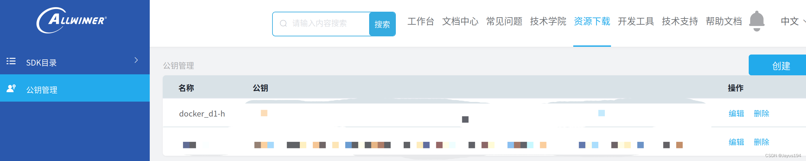
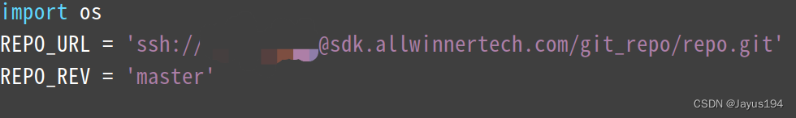
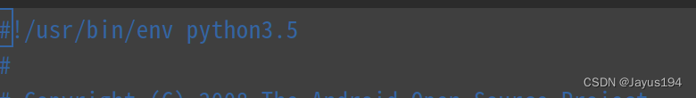

# 在docker上搭建D1-H哪吒开发板环境

[官方文档](https://d1.docs.aw-ol.com/study/study_1tina/)

## 源码下载

### 创建系统

启动docker创建一个ubuntu14.04

 |

```
docker run -it --name d1-h ubuntu:14.04

```

#### 安装必要工具

1. 将`/etc/aot/sources.list`中的内容替换为下面内容 |

```
deb https://mirrors.tuna.tsinghua.edu.cn/ubuntu/ trusty main restricted universe multiverse
# deb-src https://mirrors.tuna.tsinghua.edu.cn/ubuntu/ trusty main restricted universe multiverse
deb https://mirrors.tuna.tsinghua.edu.cn/ubuntu/ trusty-updates main restricted universe multiverse
# deb-src https://mirrors.tuna.tsinghua.edu.cn/ubuntu/ trusty-updates main restricted universe multiverse
deb https://mirrors.tuna.tsinghua.edu.cn/ubuntu/ trusty-backports main restricted
# deb-src https://mirrors.tuna.tsinghua.edu.cn/ubuntu/ trusty-backports main restricted universe multiverse
deb https://mirrors.tuna.tsinghua.edu.cn/ubuntu/ trusty-security main restricted universe multiverse
# deb-src https://mirrors.tuna.tsinghua.edu.cn/ubuntu/ trusty-security main restricted universe multiverse

# 预发布软件源，不建议启用
# deb https://mirrors.tuna.tsinghua.edu.cn/ubuntu/ trusty-proposed main restricted universe multiverse
# deb-src https://mirrors.tuna.tsinghua.edu.cn/ubuntu/ trusty-proposed main restricted universe multiverse

```

2. 安装工具 |

```
sudo apt-get update
sudo apt-get install build-essential subversion git-core libncurses5-dev zlib1g-dev gawk flex quilt libssl-dev xsltproc libxml-parser-perl mercurial bzr ecj cvs unzip lib32z1 lib32z1-dev lib32stdc++6 libstdc++6 bison busybox vim -y

```

### 添加密钥

1. 注册[全志客户服务平台](https://open.allwinnertech.com/#/login?cas=true)
2. 在docker中生成钥匙对，全程回车默认即可 |

```
ssh-keygen -t rsa

```

3. 使用`cat`查看`~/.ssh/id_rsa.pub`文件中的内容并复制 |

```
cat ~/.ssh/id_rsa.pub

```

4. 添加到全志的平台上


### 安装repo引导脚本

>

注意：下载Tina前需要使用AW提供的引导脚本和repo仓库，如已安装了google官方引导脚本，请将google官方引导脚本替换成AW提供的引导脚本，两者不兼容。

1. 使用下面命令下载repo引导脚本

>

注意：其中的`username`要换成上面在全志客户服务平台上注册的用户名

 |

```
git clone ssh://username@sdk.allwinnertech.com/git_repo/repo.git

```

如果询问 `Are you sure you want to continue connecting (yes/no)?` 的时候需要输入 `yes`。

如果遇到要求输入密码的问题时可能是上面`username`或密钥配置错误，可以在[SDK下载常见问题及解决方案](http://open.allwinnertech.com/guide/yht2/chan_pin_bao_xia_zai/sdk_xiazai_wenti.html)寻找解决方案

2.

修改`repo/repo`的`username`为自己的用户名

 |

```
vim repo/repo

```


修改后输入`:wq`保存退出

3.

添加环境变量

 |

```
cp repo/repo /usr/bin/repo
chmod 777 /usr/bin/repo

```

修改完成后可以使用`repo help`测试是否成功

如果遇到一些语法报错的问题，可以尝试修改python的版本，修改前确保你要修改的版本已安装

输入下面命令修改`~/.bin/repo`文件的第一行

 |

```
vim ~/.bin/repo

```


这里我修改为了python3.5

### 下载SDK

1. 创建存储文件夹 |

```
mkdir tina && cd tina

```

2. 配置git |

```
git config --global user.email "you@example.com"
git config --global user.name "Your Name"

```

3. 初始化repo仓库，注意替换下面命令的`username` |

```
repo init -u ssh://username@sdk.allwinnertech.com/git_repo/D1_Tina_Open/manifest.git -b master -m tina-d1-h.xml

```

如果报错可以在[SDK下载常见问题及解决方案](http://open.allwinnertech.com/guide/yht2/chan_pin_bao_xia_zai/sdk_xiazai_wenti.html)寻找解决方案

4. 同步仓库，并创建开发分支

>

如果上面没有修改repo的python版本，则可以直接使用`repo`命令

 |

```
python2.7 /usr/bin/repo sync
python2.7 /usr/bin/repo start product-smartx-d1-tina-v1.0-release --all

```

- 在`repo sunc`时可能会遇到证书验证不通过的问题，可以先尝试执行下面命令更新证书 |

```
apt update
apt install ca-certificates
apt upgrade ca-certificates

```

如果更新后仍然不通过可以执行下面命令之一禁用SSL验证

 |

```
git config --global http.sslVerify false
# 或
export GIT_SSL_NO_VERIFY=true

```

### 编译打包

 |

```
source build/envsetup.sh
lunch
make -j32
pack

```

-

确保在`bash`终端中执行想面命令

-

lunch中选择方案时输入对应序号即可

-

在`make`时可能会遇到下面报错

 |

```
configure: error: you should not run configure as root (set FORCE_UNSAFE_CONFIGURE=1 in environment to bypass this check)

```

可以尝试下面方法

 |

```
export FORCE_UNSAFE_CONFIGURE=1
make -j32 FORCE=1

```
